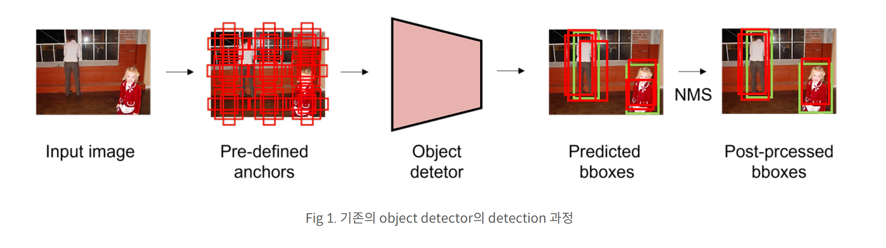
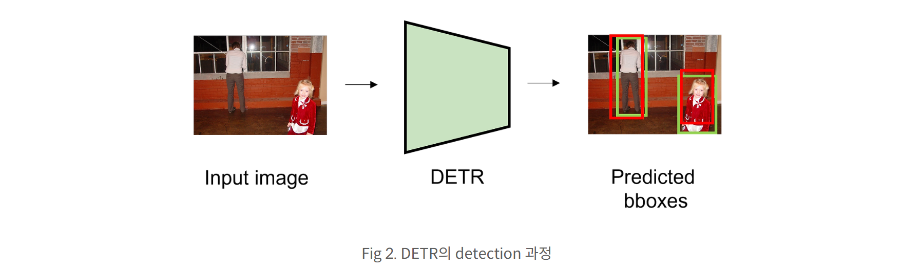

# DETR
### DETR의 Object Detection 접근법
1) Object Detection을 Set 예측 문제로 정의
- Bounding box(B)와 Category(C)로 구성된 집합(Set) G 예측
- 즉, G = {(B₀, C₀), (B₁, C₁), ..., (Bₙ, Cₙ)}

2) 기존 방법의 한계
- Set을 직접 예측하지 않고, Proposal, Anchor, Window Center 등을 활용한 간접적인 탐색 방식 사용

3) 본 논문의 접근법
- 기존 복잡한 pipeline을 간소화
- Set을 직접 예측하는 방식 제안

### 기존 Object Detection 방법론

1) Anchor 기반 탐지
2) Bounding Box 예측 과정
3) Many-to-One 문제
4) NMS(Non-Maximum Suppression) 필요성

### DETR(Object Detection with Transformers) 특징

1) Hand-crafted Anchor 미사용  
  - 기존 방식처럼 여러 크기의 anchor를 직접 정의하지 않음  

2) One-to-One Matching  
  - 하나의 ground truth에 대해 오직 하나의 bounding box만 매칭됨  
  - 기존 방법의 Many-to-One 문제 해결

3) Redundant Bounding Box 없음
  - 하나의 ground truth를 예측하는 bounding box가 하나뿐
  - 중복된 예측 제거 필요 없음 

4) Post-Processing 불필요
  - NMS(Non-Maximum Suppression) 같은 후처리 과정 필요 없음

# CO-DETR
