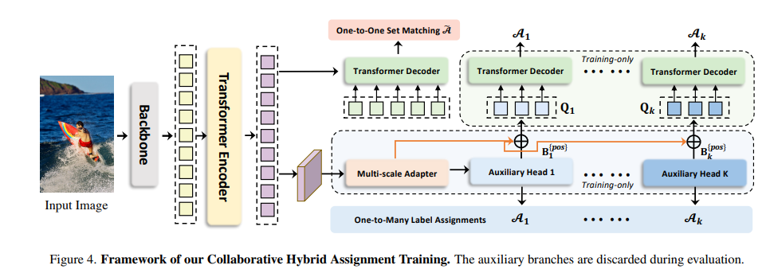

# DETR
### 1️⃣ DETR의 Object Detection 접근법
1) **Object Detection을 Set 예측 문제로 정의**
- Bounding box(B)와 Category(C)로 구성된 집합(Set) G 예측
- 즉, G = {(B₀, C₀), (B₁, C₁), ..., (Bₙ, Cₙ)}

2) **기존 방법의 한계**
- Set을 직접 예측하지 않고, Proposal, Anchor, Window Center 등을 활용한 간접적인 탐색 방식 사용

3) **본 논문의 접근법**
- 기존 복잡한 pipeline을 간소화
- Set을 직접 예측하는 방식 제안

 

### 2️⃣ 기존 Object Detection 방법론

1) **Anchor 기반 탐지**
  - 사전 정의된 anchor 사용
  - 이미지 내 고정된 지점마다 다양한 scale, aspect ratio를 가진 anchor 생성

2) **Bounding Box 예측 과정**
  - Anchor 기반으로 예측된 bounding box 생성
  - Ground truth와 IoU(Intersection over Union) 값 비교하여 매칭
  - Threshold 기준:
    - IoU가 일정 값 이상 → Positive sample
    - IoU가 일정 값 이하 → Negative sample

3) **Many-to-One 문제**
- 하나의 ground truth에 대해 여러 개의 bounding box가 매칭됨.
- 즉, 예측된 bounding box와 ground truth의 관계가 many-to-one 구조

4) **NMS(Non-Maximum Suppression) 필요성**
- 다수의 anchor로 다양한 객체 크기·형태 포착 가능.
- 하지만 near-duplicate, redundant한 예측 발생함.
- 이를 제거하기 위해 NMS와 같은 post-processing 필수.

 

### 3️⃣ DETR(Object Detection with Transformers) 특징

1) **Hand-crafted Anchor 미사용**  
  - 기존 방식처럼 여러 크기의 anchor를 직접 정의하지 않음  

2) **One-to-One Matching**  
  - 하나의 ground truth에 대해 오직 하나의 bounding box만 매칭됨  
  - 기존 방법의 Many-to-One 문제 해결

3) **Redundant Bounding Box 없음**
  - 하나의 ground truth를 예측하는 bounding box가 하나뿐
  - 중복된 예측 제거 필요 없음 

4) **Post-Processing 불필요**
  - NMS(Non-Maximum Suppression) 같은 후처리 과정 필요 없음

 
 

# CO-DETR
### 1️⃣ 기존 DETR의 한계점
1) **Convergence 속도 문제** 
- 기존 DETR은 학습 속도가 느려 50 epoch 이상이 필요함.
- 주된 원인은 one-to-one matching 전략이 학습 초기에는 불안정하여, 효과적으로 학습되지 않기 때문.

2) **Detection 성능의 한계**
- 기존 DETR은 중복된 예측이 없다는 장점이 있지만, 그로 인해 일부 객체를 제대로 탐지하지 못할 수 있음.
- 즉, high-recall을 달성하기 어려운 문제가 발생.

 

### 2️⃣ CHATr: Collaborative Hybrid Assignments Training
- DETR의 느린 수렴 문제를 해결하기 위해 Hybrid Matching 전략을 도입

1) **핵심 아이디어**
- 기존 DETR의 one-to-one matching 방식 + 기존 many-to-one matching 방식 결합
- 학습 과정에서 one-to-one matching & many-to-one matching 함께 사용 → 학습 안정화

2) **Hybrid Matching 방식**
- One-to-One Matching (DETR 방식)
  - Hungarian Matching 사용 → ground truth와 하나의 예측을 강하게 매칭
  - 중복된 예측을 방지하지만, 학습이 어려운 단점이 있음

- Many-to-One Matching (Anchor 방식과 유사)
  - 하나의 ground truth에 대해 여러 개의 예측을 학습하도록 설계
  - 학습 초기에 더욱 안정적인 loss 신호 제공 → 수렴 속도 향상

- Final Matching Strategy
  - 초반 학습: Many-to-One Matching이 dominant → 학습 안정화
  - 후반 학습: One-to-One Matching으로 점차 전환 → 중복 예측 제거

 

### 3️⃣ CHATr 구조 및 학습 과정

1) **DETR 기반 아키텍처 유지**
- 기존 DETR 구조를 유지하면서, hybrid matching 방식을 적용하여 학습 진행

2) **Loss Function 개선**
- 기존 DETR의 Hungarian Loss에 Many-to-One Matching Loss를 추가하여 학습 안정화
- 학습 초기에 다양한 예측을 활용하여 학습 속도 개선

 

### 4️⃣ 실험 결과
(1) **학습 속도 개선**
- 기존 DETR 대비 50% 이상 빠른 수렴 속도
- 기존 50 epoch 필요 → CHATr는 25 epoch 내 수렴

(2) **성능 향상**
- 기존 DETR 대비 AP(Accuracy) 향상
- 특히 작은 객체 탐지에서 성능이 개선됨

(3) **Computational Cost 유지**
- 기존 DETR과 유사한 연산량을 유지하면서도 성능 개선

 

### 5️⃣ 결론 및 의의
- DETR의 느린 수렴 문제를 해결하기 위해 Hybrid Matching 전략을 도입
- 학습 초기에 Many-to-One Matching을 활용하여 학습을 안정화하고, 후반에는 One-to-One Matching으로 전환
- 결과적으로 학습 속도 개선, 성능 향상, 기존 DETR 구조 유지라는 장점을 가짐
- 향후 DETR 기반의 다양한 모델에서도 활용 가능
